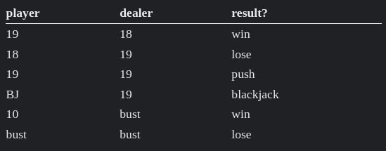

Can you see me now?
---
Please star and clone repository:

https://github.com/Test-Government/nordic-testing-days-2024-talk

<!-- end_slide -->

A Brief History of Electronic Identity projects Nortal
---

# ID-Card, Mobile-ID, Smart-ID registration and certificate issuance

## Issue authentication and signing certificate

<!-- end_slide -->

ID-Card
---

<!-- end_slide -->

Mid
---

<!-- column_layout: [5, 5] -->
<!-- column: 0 -->

<!-- column: 1 -->

<!-- end_slide -->

Smart-ID
---

<!-- end_slide -->

Authentication services
---

# National authentication service (TARA)

https://github.com/e-gov/TARA-Test

# State SSO service (GovSSO)

https://github.com/e-gov/GovSSO-Test

# Cross-border authentication service (eIDAS-Node)

https://github.com/e-gov/eIDAS-SpecificProxyService-Test
https://github.com/e-gov/eIDAS-Client-Test
https://github.com/e-gov/eIDAS-SpecificConnector-Test

# Central authorisations management information system (Pääsuke)

<!-- end_slide -->

Signature services
---

# DigiDoc4j

# Signature Gateway (SiGa)

https://github.com/open-eid/SiGa-Tests

# Signature Verification (SiVa)

https://github.com/open-eid/SiVa-Test

<!-- end_slide -->
A Brief History of Electronic Identity projects Nortal
---

## Product is a long lived API

## Nortal is expected to release with velocity after years of neglect

## Microservices with internal OpenAPI first

<!-- end_slide -->
ID-Card issuance
---

<!-- end_slide -->

Back in my day bugs mattered
---

# 2015 negative modulus

250 000 ID-Cards not working with Chrome

According to ASN.1 DER encoding, integers are encoded using two’s
complement representation interpreting the most significant bit as a sign bit. This
requires positive integer values that have the most significant bit of the most
significant byte set to be zero-padded. The ID card certificates were encoded
ignoring this requirement.

Negative modulus:
3082010A02820100008059A48FBF218E2C47A1F98AB5641A0A07537F018EA67DF027579EE79A68704891B3D5D4D12B791575DB4D8CB8760CFC29113FC8626065F1E4B21BB3734DFEC77CF31C5146ABCC2C37CF758D38A4C141038BBC90EDF32BF03CB0004992AB3452B2D9266E5ECB5F40CB636FEFB910ADDB612EEEA2ABAEB02930AD40900BDBE756B1B5E99A0762A2F55A7B30500CE62B058AA34EC9F369F2BCE3C626FE25DFB847AF15E5B0793D965AA9D7F28E4BDE7A8E47F83A5025E4A079188509DCED08AD1550EBE5CC673AEA2027B879A1C854D5920DBACA3A63FC439C5E0B5B0D06707FD3EC3531EC20243104E6CB67BA9E8EFF5D65E96BFBDA90797AEA57EC1178D15CC50203010001

<!-- end_slide -->

2017 Return of Coppersmith's attack
---

700 000 vulnerable ID-Cards

152 million € court case for generating private keys outside ID-Card

2.2 million € settlement

https://en.wikipedia.org/wiki/ROCA_vulnerability
<!-- end_slide -->

Failure to revoke ID card certificates of deceased cardholders
---

Once a day, an information system run by the IT and Development Centre at the
Estonian Ministry of the Interior (SMIT) sends requests to SK to revoke the
affected certificates. According to PPA, from 2014 to mid-2015 the data was
submitted to the SK information system using incorrect request parameters and
this resulted in an error. As the data exchange was not monitored on either side,
the error was only discovered in the middle of 2015.

The Chancellor of Justice concluded that if a person had suffered damage, it is
possible to apply for compensation from PPA under the State Liability Act

<!-- end_slide -->

Prime minister is disappointed
---

<!-- end_slide -->

Passing the blame
---

<!-- end_slide -->

My biases in 2015
---

# Python - RobotFramework

# Java - Fit/FitNesse

<!-- end_slide -->

Environment
---

* Monolithic application (modules)
* SSH to VM, modify configuration, test, leave
* Ask in chat if you can take CA, remote desktop into Windows, do your changes, export XML to git
* Jenkins builds and deploys WAR to VM, restart Tomcat, run tests
* Oracle Database
* Commercial CA software running on Windows

<!-- end_slide -->

Tests overview
---

# SoapUI

* Tests are flaky and hard to maintain
* Couple of thousand test cases
* Each with ~20 steps
* Responses with ~10 assertions
* Groovy scripts copy-pasted

<!-- end_slide -->

Test evolution
---

# Trapped in a tool

Never enough time to move to a better tool, always dealing with daily problems

# Java Unit tests in new project

# Groovy library from SoapUI with Groovy tests in new module

# Waiting for old projects to die

<!-- end_slide -->

Creative solutions to stupid problems
---

# Branches are free, merging is a problem

## Split up QA engineers across modules and projects

# Refactoring in SoapUI

## Use tests as methods

## Python script to find TestSuite/TestCase/Step/(Assertion) where occurrence is found

# Code duplications

## Groovy library for common utilities - generating person

## Requires restarting SoapUI to load new library version

<!-- end_slide -->

Petclinic
---

http://petclinic.local.teststuff.net:8080/#!/owners

# Find owners

# Add pet

<!-- end_slide -->

OwnersTest1
---
<!-- column_layout: [5, 5] -->
<!-- column: 0 -->

# Plain Java + JUnit

# Rest-Assured

# IntelliJ IDEA, yay for a debugger

# Could be mistaken for a Spring Boot Integration test

# testFindOwners breaks when testAddPet is run

<!-- column: 1 -->

<!-- end_slide -->

OwnersTest2
---

# Tests create their own data

<!-- end_slide -->

OwnersTest3
---

https://youtu.be/IrVA1BBHFHw?t=34

https://www.google.com/search?q=merge+files+excel+vba

O, that way madness lies; let me shun that;

No more of that.

I want my IDE back.

<!-- end_slide -->

OwnersTest4
---

# Groovy is Java without the boring bits

cp OwnersTest1.java OwnersTest4.groovy

sed -i 's/class OwnersTest1/class OwnersTest4/' OwnersTest4.groovy

sed -i 's/public//' OwnersTest4.groovy

sed -i 's/;//' OwnersTest4.groovy

# Literal data (Strings, Maps)

## Copy from browser, logs, Wireshark, Swagger UI

<!-- end_slide -->

OwnersTest5
---

Same as OwnersTest2 but with nice Map literals

<!-- end_slide -->

OwnersTest6
---

# Still JUnit

# Data driven with data in IDE and inside test

5.times {
println "Hello, World!"
}

<!-- end_slide -->

OwnersTest7
---

# Spock is an extension to JUnit

# Data driven testing with data as code

<!-- end_slide -->

OwnersTest8
---

# Enter Allure report

# Report for QA people coming to work in the morning

./mnw allure:serve

<!-- end_slide -->

OwnersTest9
---

<!-- end_slide -->

OwnersTest10
---

# George has an elephant

<!-- end_slide -->

Reading list
---

# Groovy

Coding exercises - https://github.com/nadavc/groovykoans
Design Patterns in Groovy - https://www.youtube.com/watch?v=YSEcVlYiGIU

# Automation

The "A" Word - https://leanpub.com/TheAWord
http://www.satisfice.com/articles/test_automation_snake_oil.pdf
https://martinfowler.com/articles/microservice-testing/

Why Good Developers Write Bad Tests - https://www.youtube.com/watch?v=oO-FMAdjY68
<!-- end_slide -->

Specifications
---

# Bridging the Communication Gap

# Specification by Example

# Fifty Quick Ideas to Improve Your Tests

# Living Documentation: Continuous Knowledge Sharing by Design

<!-- end_slide -->

# Best Current Practises

* Git MUST be the single source of truth
    - Merge conflicts are resolvable
    - Immutable environments are stored in git
    - No "blobs" in pull requests and code reviews
    - State is repeatable from a tag
* Everybody MUST have their own test environment
* Test environments MUST work offline
* Out of the Box Experience MUST be prioritised over CI considerations
* Everything MUST be open source and replaceable
* Test data MUST NOT be hidden
* Requirements MUST have unique identifiers
* There SHOULD be a maximum of 5 E2E tests

<!-- end_slide -->
