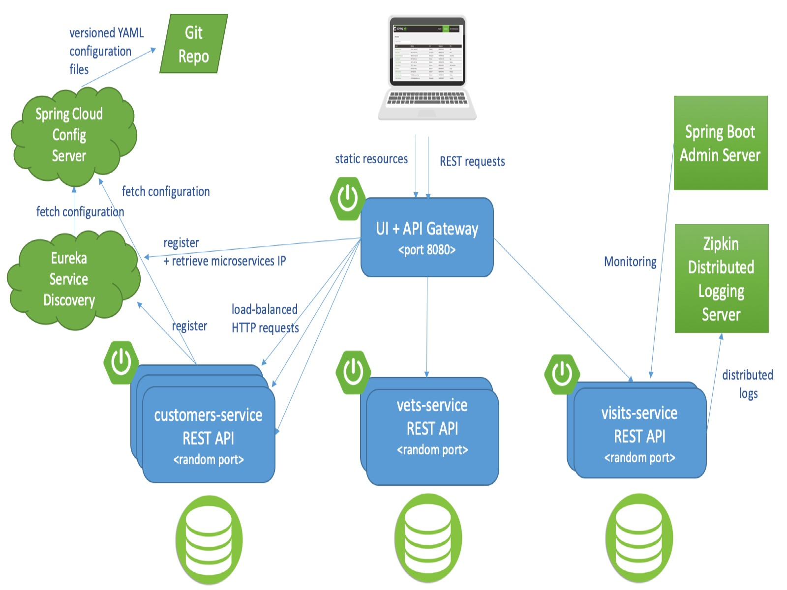

# Distributed version of the Spring PetClinic Sample Application built with Spring Cloud

From https://github.com/spring-petclinic/spring-petclinic-microservices/blob/main/README.md

If everything goes well, you can access the following services at given location:

* Discovery Server - [http://localhost:8761](http://localhost:8761)
* Config Server - [http://localhost:8888](http://localhost:8888)
* AngularJS frontend (API Gateway) - [http://localhost:8080](http://localhost:8080)
* Customers, Vets and Visits Services - random port, check Eureka Dashboard
* Tracing Server (Zipkin) - [http://localhost:9411/zipkin/](http://localhost:9411/zipkin/) (we use [openzipkin](https://github.com/openzipkin/zipkin/tree/main/zipkin-server))
* Admin Server (Spring Boot Admin) - [http://localhost:9090](http://localhost:9090)

